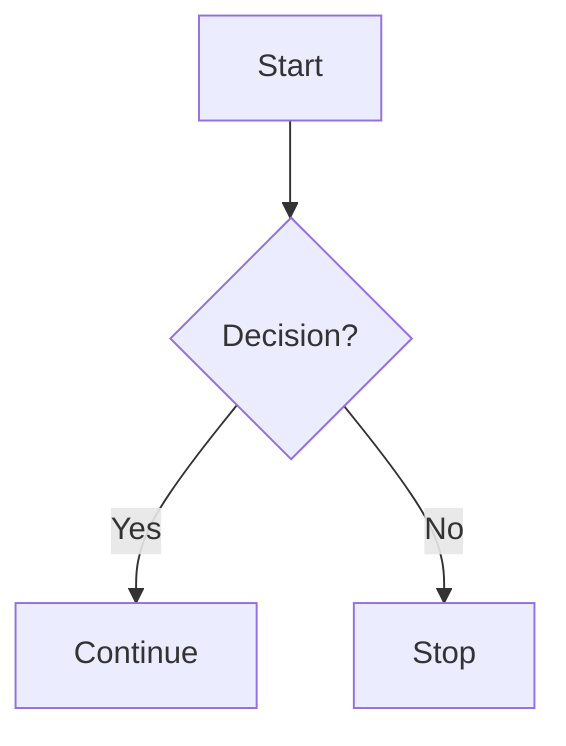

# Table of Contents

1. [Introduction](#slide-1)
2. [Analysis](#slide-3)
3. [Conclusion](#slide-5)

---
Render inline math such as $ax^2+bc+c$.

$$ I_{xx}=\int\int_Ry^2f(x,y)\cdot{}dydx $$

$$
f(x) = \int_{-\infty}^\infty
    \hat f(\xi)\,e^{2 \pi i \xi x}
    \,d\xi
$$ 

----
# Part 1
## test :smile:
test textloreoeorieoriporei slkdjfslkdjflksjdlskdjflkdsfldkjflksd sdfjslkdjfkdsfslkdfj sdlkfjsldkjfdf sldkjfdkljflksdjf sdlkfjksdjflskdjfsdfsdlkfjsdlkf sldkfjsdlk fsldkjf sdfjslkdjfdlk dklfjsldkjfsdf dslkfjsdkfj sdf sdlfkjdsf
sdfjlds  

----
# Code example

```python
import pandas as pd
set()
pd.DataFrame()
```

```julia
import pandas as pd
set()
pd.DataFrame()
```

---


## **4. Tables for Simple Schemes**
You can also structure simple schemes using tables.

| Step | Action      | Result      |
|------|------------|------------|
| 1    | Start      | Initialization |
| 2    | Process    | Execution  |
| 3    | End        | Termination |